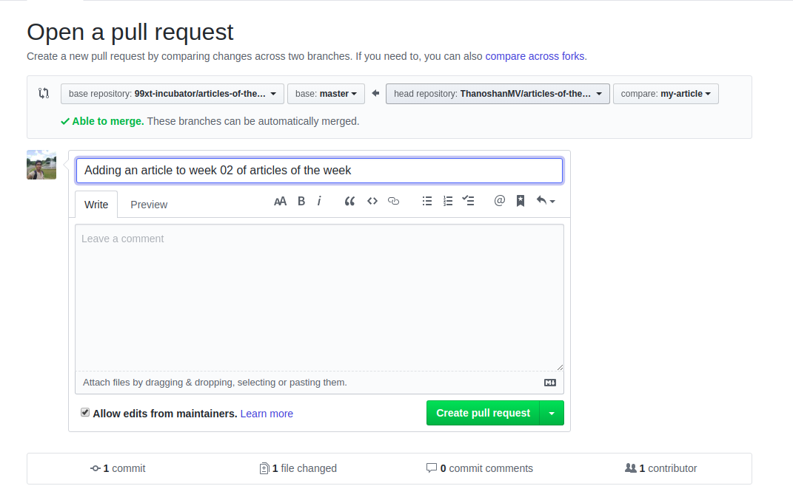

<h1>
Useful commands for opensource contribution in github
</h1>
<h2>Git commands</h2>

<h2>
Clone the repository using  <b>Step 1:</b> git clone "https://github.com/username/reponame"
</h2>

<h2>
<b>
Step 2:</b>
Now go to the working directory 
using</h2>
 <h3>cd directory name</h3>

<h3>

<b>Step 3: </b>git remote add upstream httlp://www.github/reponame/ </h3>
<h3>
<b>Step 4:</b>git pull upstream master/main</h3>

This will add remote repo in your local system and sync with the repo

<h3>

<b>Step 5: </b>git checkout -b branch Name
</h3>

it will make a new branch for you and switch the branch also

 <h2> Now add you changes in the files</h2> 

<h3> <b>Step 6: </b>git switch master/main
</h3>
<h4>Switch to the main branch</h4>

<h3><b>Step 7: </b> git add .
</h3>
<h4>
Add the changes in the files and folders</h4>

<h3>
<b>Step 8: </b>git commit -m "commit message"
</h3>
<h4>
Commit the changes with a commit message</h4>

<h3>
<b>Step 9: </b>git push
</h3>
<h4>
Push the changes</h4>

<h3>
<b>Step 10: </b>After that create a pull request</h3>

